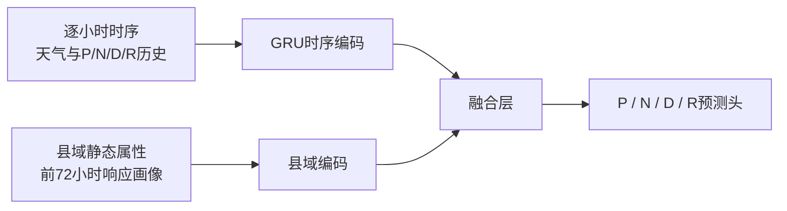

> 好的明白。我们不需要给4个horizon使用同一个规则，所以后续会考虑短期和长期分开判断的情况。在跑下一个模型之前，请你思考探究这些问题;
1. 为什么第二折退化明显
2. P和D的的误差贡献大是因为他们在osi里的权重大，所以提升它们比较有价值？还是从本身的值来看，模型就是对这两个值学的比较差？
3. 由于时间窗口问题，末尾的窗口和前面不太一样（可能会缺数据之类的），我们有必要单独处理这些不同的窗口吗？

这三个问题可以归结为两个主要现象：

- `fold=2` 的异常主要由少数高严重度县驱动，与末尾窗口缺失关系不大。
- P/D 对 OSI 误差贡献大，既受公式权重影响，更主要是它们本身的数值尺度和绝对预测误差更大；从相对可解释程度看，N/R 反而更难学。
- 窗口差异值得处理，但不建议拆出单独的“末尾模型”。更合适的是按 horizon 限制特征窗口，使每个模型只使用语义一致、能够完整覆盖到自身目标时刻的天气特征。

以下分析只读取了现有 v1.8 产物，没有训练模型或修改文件。

## 1. 为什么 `fold=2` 退化明显

先澄清编号：报告中的 `fold=2` 是代码从 0 开始编号的第三折。如果你说的是日常语言里的“第二折”，即 `fold=1`，那么它并没有退化：C3 的 t+48 RMSE 从 C1 的 `0.005771` 改善到了 `0.005551`。

真正异常的是 `fold=2` 的 t+48：

| 模型 | fold=2 t+48 RMSE |
|---|---:|
| C0 直接 OSI | 0.013045 |
| C1 分量重组 | **0.012997** |
| C3 分量对齐 | 0.013447 |

### 1.1 这一折本身远比其他折困难

t+48 真实目标在各折中的分布：

| Fold | 目标标准差 | 99分位 | 最大值 | OSI>0.05 行数 |
|---|---:|---:|---:|---:|
| 0 | 0.00578 | 0.0298 | 0.0846 | 15 |
| 1 | 0.00607 | 0.0302 | 0.0901 | 13 |
| **2** | **0.01692** | **0.0954** | **0.3277** | **75** |
| 3 | 0.00596 | 0.0299 | 0.0712 | 16 |
| 4 | 0.00817 | 0.0399 | 0.1199 | 32 |

`fold=2` 的标准差约是其他多数折的三倍，高严重度样本数量也高得多。它包含了一批模型普遍严重低估的县，因此 C0、C1、C3 在这一折都明显更差。

现有 `balanced_v1` 平衡了州、严重度等级和县数，但严重度等级是粗粒度分类，无法保证每个 horizon 的连续目标分布、极端峰值和总平方损失都均衡。单场风暴下，只要两三个极端县落在同一折，就能显著改变该折 RMSE。

### 1.2 C3 的额外退化几乎由两个县造成

C3 相对 C1 在 `fold=2` 的 t+48 总平方误差增加约 `0.05485`。主要来源是：

| FIPS | 县 | C1县级RMSE | C3县级RMSE | 增加的SSE |
|---|---|---:|---:|---:|
| 54013 | Calhoun County, WV | 0.04886 | 0.05230 | 0.03343 |
| 54015 | Clay County, WV | 0.05683 | 0.05904 | 0.02456 |
| 39157 | — | 0.01805 | 0.01862 | 0.00201 |

Calhoun County 单独解释了净退化的约 61%。前两个县带来的增加已经超过全部净退化，说明其他县其实抵消了一部分损失。

典型时刻如下：

| 县 | 目标时刻 | 真实 OSI | C1 | C3 |
|---|---|---:|---:|---:|
| Calhoun | 3月16日 22:00 | 0.1820 | 0.0584 | 0.0444 |
| Calhoun | 3月16日 21:00 | 0.1910 | 0.0531 | 0.0411 |
| Clay | 3月16日 20:00 | 0.1724 | 0.0461 | 0.0356 |
| Clay | 3月17日 12:00 | 0.1670 | 0.0495 | 0.0411 |

C1 已经严重低估这些峰值，C3 又把不同 horizon 的分量预测平均，进一步把结果向较低的普通县预测收缩，所以平方误差被放大。

### 1.3 这不是末尾窗口导致的主要问题

`fold=2` 中 C3 相对 C1 的 t+48 额外平方误差：

- 3月16日：`+0.02408`
- 3月17日：`+0.03078`
- 3月18日：`+0.00011`
- 3月19日：`-0.00012`，反而略有改善

退化集中在3月16日至17日的高峰，而不是数据末尾的3月19日。因此，末尾天气窗口截短不能解释这次主要退化。

更准确的解释是：

1. `fold=2` 包含异常多的长期高严重度样本。
2. 两个西弗吉尼亚县产生了大部分额外损失。
3. C3 的平均操作降低了预测方差，对普通县有利，但把极端县的高峰压得更低。
4. RMSE 对这几个大误差极其敏感，因此出现“MAE改善、RMSE退化”。

我建议保留 `fold=2` 作为压力测试，不要为了让折指标好看而重新分折。后续可以增加重复县级 CV 或跨州/区域验证，判断这些县究竟是偶然异常，还是当前县级脆弱性特征无法描述的一类系统性问题。

---

## 2. P/D 的误差贡献为什么大

答案是：**公式权重有影响，但更主要的原因是 P/D 的数值尺度和绝对误差大。它们并不是相对意义上学得最差的分量。**

以 t+48 为例：

| 分量 | OSI权重 | 目标标准差 | 原始RMSE | RMSE/标准差 | 加权误差RMSE |
|---|---:|---:|---:|---:|---:|
| P | 0.40 | 0.01509 | 0.01222 | 0.81 | **0.00489** |
| N | 0.35 | 0.00359 | 0.00344 | **0.96** | 0.00120 |
| D | 0.25 | 0.01386 | 0.01060 | 0.76 | **0.00265** |
| R | -0.10 | 0.00338 | 0.00328 | **0.97** | 0.00033 |

### 2.1 权重确实重要

P 的权重是 0.40，为四个分量最高。相同大小的分量误差传到 OSI 后，P 的影响最大。

D 的权重只有 0.25，低于 N 的 0.35，但 D 的误差贡献仍然远高于 N。这说明公式权重并不是主要解释。

### 2.2 P/D 的原始尺度明显更大

t+48 中：

- P 标准差：`0.01509`
- D 标准差：`0.01386`
- N 标准差：`0.00359`
- R 标准差：`0.00338`

P/D 的波动尺度约为 N/R 的四倍，所以即使模型以相同比例预测错误，绝对误差也会更大。

这种差异在短期同样存在。t+1 时：

- P/D 标准差约 `0.0345/0.0360`
- N/R 标准差约 `0.0045/0.0044`

### 2.3 从相对误差看，N/R 反而更难学

用“RMSE ÷ 目标标准差”衡量模型解释目标变化的能力：

- t+1：P `0.55`，D `0.48`，N `0.95`，R `0.92`
- t+48：P `0.81`，D `0.76`，N `0.96`，R `0.97`

越低越好。P/D 虽然绝对误差大，但模型确实学到了不少结构；N/R 的预测几乎接近“无法解释其变化”。

对应的 t+48 R²：

- P：`0.34`
- D：`0.42`
- N：`0.08`
- R：`0.06`

所以不能说“P/D 模型本身比 N/R 学得差”。更准确的是：

- **P/D：目标幅度大，模型相对学得更好，但剩余绝对误差仍然最大。**
- **N/R：目标幅度小、尖峰稀疏，模型相对学得更差，但传到 OSI 的绝对影响较小。**

### 2.4 优化价值怎么排序

目前优先级仍然应是：

1. **P 第一**：权重最高、目标尺度大、与最终 OSI 误差相关性约 0.98。
2. **D 第二**：目标尺度也大，与最终误差相关性约 0.87–0.90。
3. **N 定向优化**：权重高达 0.35，而且现在相对学习效果很差；如果能准确识别少数新增损伤尖峰，仍可能有价值。但不适合无差别扩大模型，应针对风速上升、强风到达时间等特征。
4. **R 最后**：权重绝对值和当前误差贡献都较小，除非后续发现它能系统性校正恢复阶段偏差。

这里仍需注意：四个分量误差之间存在相关性和抵消关系。不能只看到某个分量 RMSE下降就认为 OSI 一定改善，最终必须重组 OSI 后评价。

---

## 3. 是否需要单独处理不同的末尾窗口

**需要处理窗口语义，但暂时不建议为末尾单独训练一套模型。**

### 3.1 各模型自身的目标窗口其实都是完整的

对于有效标签行：

| 目标模型 | 1h窗口完整 | 6h窗口完整 | 24h窗口完整 | 48h窗口完整 |
|---|---:|---:|---:|---:|
| t+1 | 100% | 96.5% | 83.9% | 67.1% |
| t+6 | 100% | 100% | 87.0% | 69.6% |
| t+24 | 100% | 100% | 100% | 80.0% |
| t+48 | 100% | 100% | 100% | 100% |

例如 t+24 模型只有在 `t+24≤215` 时才有标签，因此它自己的 `[t,t+24]` 窗口始终完整。最后24行没有标签，也不会进入训练和评分。

真正的问题是：**每个模型当前都接收全部四组未来窗口特征。**

例如 t+1 模型在3月19日仍有有效标签，但：

- 自己的 next_1h 窗口完整；
- next_24h、next_48h 已经被数据边界截短；
- `gust_at_t48h` 等精确值可能为 NaN；
- `total_tp_next_48h` 可能从“49个点累计量”变成“只剩几个点的累计量”。

这使同一列在前半段和末尾表达不同含义。

### 3.2 v1.5.6 已经做了一部分防护

目前已有：

- `window_len_next_*`
- `is_full_next_*`
- `tp_rate_next_*`
- `gust_gt30_frac_next_*`
- `has_weather_at_t*h`

因此，树能够知道窗口有没有截短；累计降水和强风计数也有长度归一化版本。

但这些特征只是告诉模型“窗口不同”，没有消除以下问题：

- 截短后的累计量仍与完整窗口不可直接比较。
- 缺失模式可以成为“当前已经到了3月19日”的事件位置代理。
- t+1 模型可能依赖目标发生之后几十小时的天气。这在比赛规则上允许，因为天气已知，但物理上它不可能导致 t+1 的停电，更容易学到只适用于当前风暴的时间对应关系。
- v1.5.6 实验中窗口质量特征的重要性和独立收益都较小，说明仅加入标志还不够。

### 3.3 建议的处理方式

下一轮应先做一个**不增加新特征的目标专属特征筛选实验**：

- t+1：保留 next_1h，去掉 next_6/24/48 及 t+6/24/48 精确天气。
- t+6：保留 next_1h、next_6h，去掉更长窗口。
- t+24：保留 next_1/6/24h，去掉 next_48h。
- t+48：保留全部窗口。

核心原则是：一个模型使用的天气窗口不要越过自己的目标时刻。这样，每个有效训练样本的相关窗口天然完整，特征含义也更一致。

对于累计类变量：

- 完整窗口保留总量；
- 可能截短的窗口优先使用 `rate` 或 `fraction`；
- 保留明确的长度和完整性标记；
- 不用零填补窗口外不存在的天气。

对于 C3，同一目标小时的各个候选模型最好都采用“从各自原点到共同目标”的天气摘要。这样，不同 horizon 候选虽然原点不同，但都在描述同一个目标之前的天气过程，可比性会比当前更好。

### 3.4 不建议立即拆成末尾专用模型

原因有三个：

1. 数据已经很少，拆出末尾模型会继续减少县时样本。
2. 末尾位置与风暴阶段、日期完全重合，单独模型很容易记住本次事件的日历位置。
3. `fold=2` 的主要问题发生在3月16日至17日，并非末尾截短区间。

因此，更合理的顺序是：

1. 保持 C0/C1/C3 和固定五折不变。
2. 为不同 horizon 使用不同的特征列集合。
3. 按“窗口完整/不完整”和目标日期分别报告 OOF。
4. 只有当某个末尾区间在多数折中都稳定呈现不同规律时，再考虑确定性的分段规则。
5. 暂不训练独立的尾部模型。

现有证据支持下一轮优先做“**目标专属窗口筛选 + 分量模型**”，这比增加网络复杂度或拆分更多模型更直接地针对当前问题。

> 你要不先看一下各个horizon模型贡献最大的特征有哪些？我不确定这样减少特征是否会让lightgbm性能下降。而且照理来讲，如果某个特征真的不相关，lightgbm会自动不选它，不需要手动调整。此外，本次比赛的测试集是同一个风暴，所以在风暴上我们不需要泛化，学到当前风暴即可。我还有一个问题关于分量。现在模型基本没有学到N/R的特征，这是源于什么？

你这个判断是对的。我重新看了 v1.8 各 horizon 最终模型的 gain importance 后，需要修正之前“按 horizon 删掉目标时刻以后的天气窗口”的建议：**目前没有证据支持直接减少这些特征，现阶段应保留 v1.5.6 的完整特征集。**

各 horizon 的直接 OSI 模型，最主要特征如下：

| Horizon | 贡献最大的特征 | 前12项累计贡献 | 超过目标时刻的天气特征贡献 |
|---|---|---:|---:|
| t+1 | `hours_since_obs`、`last_P_t`、`last_osi`、`last_outage_pct`、`N_t_mean_72h` | 80.1% | 8.6% |
| t+6 | `hours_since_obs`、`last_osi`、`last_P_t`、`gust_x_hso`、`cumul_gust_since_onset` | 73.6% | 7.5% |
| t+24 | `hours_since_obs`、`last_osi`、`mslma_t`、`cumul_gust_since_onset`、`pct_forest` | 66.5% | 8.4% |
| t+48 | `gust_mean_next_48h`、`pct_forest`、`last_osi`、`cumul_gust_since_onset`、`gust_gt30_next_24h` | 68.2% | 不适用 |

P、D 分量模型的情况非常接近：

| Horizon | P模型超目标天气贡献 | D模型超目标天气贡献 |
|---|---:|---:|
| t+1 | 9.2% | 8.7% |
| t+6 | 8.0% | 7.3% |
| t+24 | 6.9% | 9.3% |

这里的“超目标天气”例如：预测 t+1 时使用 next 6h、24h、48h 的天气窗口。7%～9% 的 gain 不能算可以忽略，直接删除确实可能让 LightGBM 性能下降。

另外，项目中已经有一个实际证据：v1.5.3 删除一批高共线特征后，四个 horizon 的 RMSE 都退化了约 1.4%～2.8%。这说明相关特征在树模型里可能互为替代，也可能在 `feature_fraction=0.8` 时提供不同的候选分裂。根据共线性或语义手动删除，不一定有利。

你说的两个理由都成立：

1. LightGBM 通常会跳过完全无效的特征；
2. 测试集和训练集属于同一场风暴，因此未来天气、时间位置、窗口完整度可以作为“当前风暴发展到什么阶段”的有效信号。

严格来说，LightGBM 的特征选择仍不是完美的：它是贪心地寻找局部分裂，小样本下也可能使用偶然相关特征。但在本次比赛的设定里，我们并不追求跨风暴泛化。训练县和测试县之间仍要泛化，但风暴时间轴、天气过程和窗口缺失模式大体共享。因此，这些风暴阶段特征比普通跨风暴预测场景更有价值。

我的建议是：**完整的 v1.5.6 特征继续作为主线；不按 horizon 主动删特征。** 如果以后做删减，只把它当消融实验，必须以 OOF 和最终 OSI 指标证明有效后再采用。

---

关于 N/R，模型并非没有使用特征，而是**用了许多特征，却没有找到强而稳定的解释关系**。

它们的特征重要性明显比 P/D 分散：

| 分量与 Horizon | 贡献最大的部分特征 | 前12项累计贡献 |
|---|---|---:|
| N t+1 | `last_N_t`、t+48风速、当前气压、开发用地、累计强风 | 34.7% |
| N t+6 | 未来24h降水、`pct_unmapped`、森林比例、人口密度、客户数 | 34.4% |
| N t+24 | 森林比例、t+24阵风、风向、土壤湿度、客户数 | 33.3% |
| N t+48 | 森林比例、气压变化、未来48h平均阵风、降水、温度变化 | 43.1% |
| R t+1 | `hours_since_obs`、`gust_x_hso`、`last_osi`、`last_N_t` | 42.0% |
| R t+6 | `hours_since_obs`、`gust_x_hso`、`last_P_t`、`N_t_mean_72h` | 39.1% |
| R t+24 | 未来48h降水、森林比例、t+24温度、当前气压 | 39.1% |
| R t+48 | 森林比例、人口密度、小时周期、未来温度、累计阵风 | 38.4% |

相比之下，P/D 的前12个特征通常能解释约 64%～81% 的总 gain。这说明：

- P/D 存在比较明确的主导信号；
- N/R 的分裂很多，但每个分裂都比较弱；
- N/R 的低预测能力并非简单的“天气特征没加入”。

事实上，N/R 对未来天气的使用比例反而更高：

| Horizon | N模型中超目标天气贡献 | R模型中超目标天气贡献 |
|---|---:|---:|
| t+1 | 26.6% | 21.8% |
| t+6 | 24.7% | 18.3% |
| t+24 | 10.5% | 18.7% |

所以它们已经在积极寻找天气信号，只是这些信号没能明显转化为泛化能力。

造成这一现象主要有五个原因。

### 1. N/R 是“小时流量”，P/D 更接近“状态量”

P 表示当前仍停电的比例，D 是经过平滑的停电状态。它们有很强的连续性：

> 一个县上一小时停电很多，下一小时大概率仍然不少。

所以 `last_P_t`、`last_osi`、`hours_since_obs` 很容易形成强预测关系。

N 和 R 分别是一个小时内新增和恢复的量。它们更像短促的脉冲：大部分小时接近零，少数小时突然跳高。上一小时 N 很低，并不代表下一小时不会突然出现大量新增停电。

### 2. N/R 极度稀疏，而且尾部很长

目前 N/R 大约有 50%～62% 的样本为零，均值只有约 0.0004～0.0009，但极端值能达到 0.20 以上。

这会导致模型面对两种完全不同的任务：

1. 判断这一小时会不会发生新增/恢复；
2. 一旦发生，判断规模有多大。

当前单个回归模型把两件事一起做，最稳妥的策略往往是预测一个接近零的小数。因此整体 RMSE 可能尚可，但高峰和县域差异学不到。

### 3. 当前 Huber 目标会弱化稀有高峰

Huber loss 的优势是避免少量异常值主导训练。但对 N/R 来说，稀有的大值很可能正是最需要学习的事件。

再加上 `min_child_samples=50` 等约束，模型很难为少数县、少数高峰小时建立专门叶节点。因此它倾向于学习 N/R 的中间水平，而不是尖峰。

这很可能是 N/R 的 R²长期只有约 0.05～0.16 的一个重要原因。

### 4. R 很大程度由业务过程决定

恢复速度除了天气，还取决于：

- 具体电力公司的抢修能力；
- 线路拓扑和设备损坏类型；
- 抢修队伍分配；
- 道路通达性；
- 用户优先级；
- 当时仍未恢复的存量。

这些信息目前大多不在特征中。森林比例、人口密度、客户数只能提供间接代理，所以 R 的可预测上限天然低于 P。

N 也有类似问题：同样的阵风，不同县的线路暴露、植被接触和配网结构不同，新增停电量可能完全不同。

### 5. 72小时以后缺少最新停电状态

预测阶段拥有未来天气，但没有未来实际停电观测。N/R 对“目标小时前一小时究竟还有多少用户停电、刚发生了多少故障”非常敏感，而模型只能使用第72小时留下的状态及其历史汇总。

随着 horizon 变长，这个隐藏状态越来越不确定。天气能告诉模型外部冲击，却不能完整告诉它电网内部还剩多少故障、已经修复多少。

---

因此，N/R 下一步更适合改“目标建模方式”，而不是先删特征。我建议后续优先试：

1. **两阶段模型**：先预测 N/R 是否大于零或是否进入高值区间，再对非零样本预测幅度。
2. **换损失函数**：对比 L2、Tweedie、`log1p` 目标和尾部加权，重点检查 Huber 是否过度压低峰值。
3. **N 与 R 分开设计**：N 更依赖天气冲击和脆弱性，R 更依赖停电存量、灾后阶段和县域运营代理。
4. **加入弱一致性约束**：让预测的 `N-R` 与 P 的变化方向保持合理一致，但不尝试用 P 唯一反推出 N/R。
5. 最终仍以 **OSI OOF** 判断价值，因为 N/R 自身 R²提高并不保证组合后的 OSI 一定提高。

当前最合理的主线是：保留 v1.5.6 全部特征，继续用 C0/C1/C3 做参照，下一轮集中处理 N/R 的零膨胀和尖峰，而不是先对四个 horizon 做大规模特征裁剪。本轮只进行了只读分析，没有修改文件或重新训练模型。

> 我明白了。那现在我们的一个方向就是给四个分量分开处理，看下是否会有改善。话又说回来，我们的时序模型是真没派上什么用场，兜兜转转又回到只用树模型做……感觉不太符合直觉啊，怎么会这样？

这种结果其实不违背直觉。更准确地说：**数据有很强的时间结构，但这些时间结构已经被特征工程和 LightGBM 吸收了；GRU 没有得到足够的、只靠序列才能识别的新增信息。**

我们目前不能说“时序模型完全没用”，而应当说：

> v3.1 的残差修正和 v3.2 的动态融合这两种接入方式，没有让 GRU 的增量信息超过它带来的估计误差。

### 1. 看起来有三万多个样本，实际只有239条县轨迹

训练表里有约 3.4 万个 `(county, target_hour)`，但它们并不是3.4万个独立时序样本，而是：

- 239个县；
- 同一场风暴；
- 每个县一条轨迹；
- 所有县共享相似的风暴时间轴。

可以把它想成239个摄像机同时拍摄同一场风暴，而不是239场不同风暴。

GRU最擅长的是从大量重复序列中学习稳定的状态转移规律，例如：

> 风速以这种方式上升后，停电一般如何发生；达到峰值后，恢复通常怎样展开。

但这里只有一次完整风暴过程。虽然有很多县，天气演化的主轴仍只有一条。GRU看到的大量小时样本高度相关，有效信息量远小于行数。

### 2. LightGBM其实已经在做时间建模

当前 LightGBM 不是只看某一个孤立时刻。它已经拥有很多人为整理好的时间信息：

- `hours_since_obs`
- `last_osi`、`last_P_t`、`last_N_t`、`last_D_t`
- 过去24/48/72小时统计
- `cumul_gust_since_onset`
- 风暴阶段交互
- 未来1/6/24/48小时天气窗口
- 目标时刻的精确天气
- 窗口完整度和有效率

这些特征相当于我们提前替模型总结了：

- 当前处于风暴哪个阶段；
- 此前累计受到了多大冲击；
- 最近停电状态是什么；
- 接下来天气会怎样发展。

所以这里并不是“树模型没有时间概念，GRU有时间概念”。实际对比更接近：

> 已经获得大量时序摘要的 LightGBM  
> 对比  
> 从原始序列中重新学习同类摘要的 GRU。

在当前样本规模下，人工窗口加 LightGBM 往往更容易训练，也更稳定。

### 3. 同一场风暴反而进一步削弱了GRU的独特优势

测试县和训练县属于同一场风暴，这确实允许模型学习当前风暴，无须跨风暴泛化。

但 LightGBM 也享受这个优势。`hours_since_obs`、未来天气以及累计阵风等特征，已经非常准确地告诉 LightGBM 当前位于风暴时间轴的什么位置。

以 t+1 模型为例，`hours_since_obs` 一项就占约29%的 gain。t+48 模型里，`gust_mean_next_48h` 占约25%。说明 LightGBM 已经很好地记住了当前风暴的阶段规律。

GRU能够进一步提供的，只剩下：

> 在同一个风暴阶段，为什么这个县应该比另一个县多停电或恢复更快？

这恰好是当前最缺信息的部分。它依赖配网结构、电力公司、线路暴露、设备状态、抢修资源等县域差异。GRU无法凭时间顺序创造这些缺失信息。

### 4. 基线残差虽然高度连续，却不一定可以被GRU预测

v3.1 中，LightGBM 残差的一小时自相关高达约 0.89～0.93。直觉上，这似乎特别适合 GRU。

但“残差连续”不等于“残差可以从现有输入预测”。

例如某个县因为缺少配网结构特征，模型连续20小时都低估。它的误差当然高度自相关，但在测试时，我们不知道未来真实误差，也没有特征告诉模型该县为什么会持续低估。

这种残差本质上可能是：

\[
\text{连续残差}
=
\text{县域隐藏差异}
+
\text{缺失的电网状态}
\]

而不是：

\[
\text{连续残差}
=
\text{可以从天气序列推断的动态规律}
\]

v3.1 的结果支持这一点：GRU没有降低残差自相关，t+24、t+48 反而略有上升。

### 5. GRU确实学到了一点东西，只是没超过基线

v3.1 中有两个值得保留的证据：

- GRU在 t+24、t+48 明显优于不读序列的 MLP；
- 加入未来天气后，t+24 的 GRU 明显优于不使用未来天气的 GRU。

这说明时序顺序和未来天气确实包含增量信息。

问题在于，GRU虽然优于简单的神经网络对照，仍然没有超过 LightGBM：

| 模型 | t+24 RMSE | t+48 RMSE |
|---|---:|---:|
| LightGBM | 0.008614 | 0.007731 |
| MLP残差 | 0.009112 | 0.008504 |
| GRU残差 | 0.008806 | 0.008151 |

所以结论并非“时序信息无效”，而是：

> 时序信息帮助了神经网络，但帮助幅度不足以弥补神经网络在小样本、稀有高值和县域差异上的弱点。

### 6. v3.2面对的是一个更难学习的问题

v3.2不再自由预测残差，而是让GRU判断：同一目标小时来自不同 horizon 的 LightGBM 预测，应该分别给多大权重。

但这些候选预测彼此高度相关，差距通常很小。模型需要从输入中判断：

> 对这个县、这个小时，究竟是 t+1 模型更可信，还是几小时前生成的 t+6/t+24模型更可信？

严格验证结果是：

- 等权平均：平均 RMSE `0.009677899`
- 静态学习权重：`0.009677312`，只改善约0.006%
- 完整 GRU：`0.009696797`，退化约0.195%

静态权重几乎无法超过平均，说明现有输入不足以稳定判断“哪个 horizon 此刻更准”。GRU加入更多自由度后，主要学到了折间不稳定的县群差异。

有趣的是，oracle凸包结果达到 `0.008856605`，比等权平均低约8.5%。这说明候选预测之间确实存在可利用空间，但目前的问题是：

> 真实值出现后，我们很容易知道该选哪个候选；真实值出现前，现有特征无法可靠判断。

这属于“选择信号缺失”，不是网络容量不足。继续扩大GRU大概率只会更不稳定。

### 7. 为什么GRU容易降低RMSE，却偶尔改善MAE

v3.1 中，GRU在 t+24、t+48 的 MAE 有小幅改善，但 RMSE 明显恶化。

这说明它可能修正了大量普通样本的小偏差，却伤害了少数高停电县。RMSE会对这些大误差施加平方惩罚。

当前数据有几个特点：

- 大部分 OSI 很低；
- 少数县和小时出现高峰；
- 高峰样本数量少；
- 县级五折使这些极端模式很难在训练折重复出现。

神经网络容易把预测拉向整体平均，于是普通样本更准，高峰更差。高 OSI 加权损失也没有解决，四个 horizon 都退化，说明不是简单增加高值权重就能补足。

---

所以，我们现在回到树模型并不是绕了一圈回到原点。前两轮时序实验已经回答了几个重要问题：

1. 残差确实有时间相关，但其主要部分不能由现有序列稳定解释；
2. 未来天气包含信息，但 LightGBM 已经吸收了相当一部分；
3. 同目标小时平均有效，主要来自降低不同预测的方差；
4. 动态选择候选存在理论空间，但缺乏可泛化的选择信号；
5. 当前瓶颈更像县域异质性、分量分布和隐藏电网状态，而不是缺少更复杂的序列网络。

接下来先给四个分量分别选择合适的树模型和目标函数，是更合理的路线：

- **P**：强状态延续，继续使用常规回归，重点拟合存量和高停电县；
- **D**：平滑状态量，强调趋势和累计冲击；
- **N**：零膨胀、稀有尖峰，尝试两阶段分类加幅度回归、Tweedie或尾部模型；
- **R**：零膨胀并受抢修过程影响，加入停电存量和风暴消退阶段的交互。

以后仍可以重新引入时序模型，但它最好承担更明确的任务，例如：

- 联合预测完整的 P/N/D/R 轨迹；
- 共享一个时间编码器，再为四个分量设置不同输出头；
- 用 P、N、R 之间的状态变化关系提供约束；
- 只对被诊断为具有稳定可预测残差的分量使用序列修正。

因此，当前结论不是“树模型比时序模型更高级”，而是**树模型加时序特征更适合这一场风暴、239个县和当前信息条件；GRU的两个接入点都没有拿到它真正擅长的重复序列和可识别状态。**这反而让下一步目标更清楚：先解决分量的分布和县域差异，再判断哪一部分确实需要序列网络。

> 好的好的。我其实也在想是否有必要弱化lightgbm，让时序有更大的发挥空间？此外，解决分量分布我知道要则没做，但县域差异呢？二者会冲突吗？我加入更多县域差异数据是否会更好？

可以研究“弱化 LightGBM”，但**不建议为了让 GRU 看起来有效而弱化最终基线**。如果弱化 LightGBM 后 GRU 获得提升，只能证明 GRU 能重新学习被我们拿掉的信息，不能证明组合后的最终性能更好。

更合适的是做“职责拆分”：

- LightGBM负责县域属性、当前状态和结构化统计；
- 时序模型负责逐小时天气轨迹与停电演化形状；
- 最后再和完整 LightGBM 基线比较。

这样可以判断时序模型到底有没有独立价值，同时保留最强的最终候选。

## 一、为什么不应主动削弱最终LightGBM

假设：

- 完整 LightGBM 的 RMSE 是 0.010；
- 删掉时序特征后变成 0.011；
- GRU再把它改善到 0.0103。

GRU相对弱基线提升了，但仍然不如原来的完整 LightGBM。这样的实验有研究价值，却不应作为最终模型。

残差越来越难学，本来就是强基线应有的表现。强 LightGBM 已经消化了：

- 状态延续；
- 风暴阶段；
- 历史累计冲击；
- 未来天气窗口；
- 静态县域差异。

留给 GRU 的残差自然更小、更噪声化。这不代表应该把已经学好的部分让出来，而意味着 GRU必须提供真正独立的信息。

我们可以保留两套模型：

| 模型 | 用途 |
|---|---|
| 完整 LightGBM | 正式性能基线 |
| 职责拆分版 LightGBM | 检验时序模型是否能独立学习序列信息 |

职责拆分实验可以让树模型只读取：

- 县域静态属性；
- 第72小时最新状态；
- 少量历史汇总；
- horizon和目标时刻。

把逐小时天气序列、逐小时 P/N/D/R 历史、未来天气路径交给 GRU。然后比较：

1. 完整 LightGBM；
2. 职责拆分 LightGBM；
3. 单独 GRU；
4. 职责拆分 LightGBM + GRU；
5. 完整 LightGBM + GRU。

只有第4或第5超过第1，才能证明 GRU有最终价值。

## 二、分量分布和县域差异并不冲突

它们解决的是两个不同层面的问题。

### 分量分布解决“目标长什么样”

例如 N/R：

- 大量为零；
- 少量为正；
- 极少数非常大；
- 普通回归容易全部预测成很小的数。

因此可以做两阶段模型：

\[
\hat N
=
P(N>0\mid X)
\times
E(N\mid N>0,X)
\]

第一阶段判断会不会发生新增停电，第二阶段预测发生后的规模。

### 县域差异解决“为什么这个县和另一个县不同”

同样的阵风下：

- 森林覆盖高、架空线路多的县可能更容易新增停电；
- 客户密度高的县，比例变化可能更平滑；
- 道路通达性差的县可能恢复更慢；
- 不同电力公司的抢修速度可能不同。

所以县域特征会同时进入两阶段：

\[
P(N>0\mid
\text{天气阶段},
\text{县域脆弱性})
\]

以及：

\[
E(N\mid N>0,
\text{冲击强度},
\text{县域脆弱性})
\]

两者是互补的：分布建模决定怎么预测，县域数据帮助预测每个县的参数。

真正可能产生冲突的是**样本进一步碎片化**。例如直接为每个县单独训练 N/R 模型，那么每个县只有一场风暴、约143个时间点，几乎一定过拟合。

因此不建议“一县一模型”，而应当：

- 所有县共享一个模型；
- 用县域特征描述差异；
- 让模型学习天气和县域属性的交互；
- 对县域效应做适度收缩。

## 三、加入更多县域数据大概率有帮助，但要看数据类型

当前模型对 P/D 的风暴阶段掌握得比较好，剩余误差越来越集中在：

> 为什么同一个时间、相似天气下，不同县的停电程度差别这么大。

这正是县域数据可能发挥作用的地方。

但“更多县域特征”不等于“更多普通人口统计变量”。最有价值的是能接近停电与恢复机制的数据。

### 第一优先级：本场风暴前72小时的县域响应画像

这类特征比通用外部数据更直接，而且完全符合“测试集是同一场风暴”的设定。

可以从已观测的0～72小时构建：

- 首次明显停电时间；
- 达到峰值的时间；
- 最大 P、最大 N、最大 R；
- 累计新增、累计恢复；
- 峰值前上升速度；
- 峰值后恢复速度；
- N/R非零小时比例；
- 高风速下的平均新增停电；
- 单位阵风对应的停电增量；
- 相似风速下，该县相对其他县的超额停电；
- 已恢复量占累计新增量的比例；
- 最近6/12/24小时 P、N、R趋势；
- 县域在前72小时中相对基线的持续高估或低估倾向。

它们能够把一些没有直接观测的电网差异压缩成“本场风暴中这个县实际表现出来的脆弱性和恢复能力”。

例如两个县的森林比例都为60%，但前72小时中：

- A县在阵风达到20 m/s后迅速出现停电；
- B县在30 m/s才明显出现停电。

那么“停电对阵风的响应斜率”比森林比例更能区分它们。

这可能是县域差异方向里最值得优先尝试的一组。

### 第二优先级：电力系统和服务区域信息

如果能获得并可靠映射，价值可能很高：

- 服务该县的电力公司或合作社；
- 各公司覆盖的客户比例；
- 服务区域是否跨县；
- 架空线路比例；
- 输配电线路密度；
- 变电站和馈线密度；
- 电网设备年龄；
- 农村电力合作社占比；
- 每平方公里客户数；
- 每个 utility 平均服务客户数。

之前的 `n_utilities` 问题说明，仅有“公司数量”不够。两个县都是3家电力公司，但可能分别是：

- 一家覆盖95%，另外两家很小；
- 三家各覆盖约三分之一。

这两种结构对统一调度和恢复速度的含义不同。因此可以考虑：

- 最大 utility 客户占比；
- utility 客户份额集中度；
- 有效 utility 数量；
- 主导 utility 类型；
- utility是否跨多个县运营。

这类变量对 R 尤其重要。

### 第三优先级：暴露、植被和可达性

已有森林、湿地、开发用地等特征，但还可以考虑更贴近机制的表达：

- 森林与人口或客户分布的重叠；
- 树冠覆盖与道路、开发区的交界长度；
- 道路密度；
- 偏远地区比例；
- 地形起伏；
- 河流、湿地造成的通行障碍；
- 强风覆盖面积比例，而不只是县域平均风速；
- 县内最大风速与平均风速的差；
- 风向与县域植被、线路走向的交互。

县级平均天气可能掩盖局部强冲击。某县只有20%的区域遭遇极端阵风，但那里恰好客户密集，县平均风速不一定能反映实际损失。

## 四、不要直接加入县ID

训练县和测试县不同，因此简单的 `county_id` one-hot 或县嵌入无法直接泛化到新县。

真正需要学习的是：

\[
\text{县域属性}
\rightarrow
\text{本场风暴下的响应方式}
\]

而不是记住：

\[
\text{某个县名}
\rightarrow
\text{历史平均标签}
\]

可以使用 utility、州、气候区等会在训练县和测试县之间共享的类别，但要检查：

- 测试集中是否出现训练时未见的类别；
- 某些类别是否只对应一两个县；
- 类别重要性是否由单个极端县支撑。

## 五、县域特征也可能帮助时序模型

加入县域信息并不会进一步排斥 GRU，反而可能解决 GRU当前最明显的问题。

当前 GRU大致在学习：

\[
\text{天气序列}
\rightarrow
\text{停电轨迹}
\]

但同样的天气序列在不同县对应完全不同的停电轨迹。更合理的形式是：

\[
\text{停电轨迹}
=
f(
\text{天气序列},
\text{县域脆弱性},
\text{前72小时响应画像}
)
\]

架构上可以有两个分支：

这样 GRU负责回答“风暴过程发展到哪里”，县域分支负责回答“这个县对该过程如何响应”。

v3.1、v3.2 的 GRU缺少足够强的县域条件，很可能把许多县的不同响应平均到一起。加入县域描述后，它才更有机会学到县间差异。

## 六、我建议的推进顺序

目前更稳妥的顺序是：

1. 保留完整 v1.5.6 LightGBM，不削弱正式基线。
2. 为 P/N/D/R 分别选择目标形式和损失函数。
3. 优先加入“前72小时县域响应画像”。
4. 再分组加入电力系统、可达性和空间暴露数据。
5. 每组县域特征分别做消融，检查总体、各 horizon、各分量和极端县。
6. 树模型路线稳定后，再做一个“县域分支 + 时序分支”的联合模型。
7. 始终与完整 LightGBM 和分量 LightGBM 对照。

我尤其看好“**分量专用模型 + 前72小时县域响应画像**”。分量建模解决 N/R 的零膨胀和尖峰问题，响应画像解决同一天气下县与县为何不同。这两个方向不冲突，而且比单纯增加GRU层数更直接地对应当前误差来源。